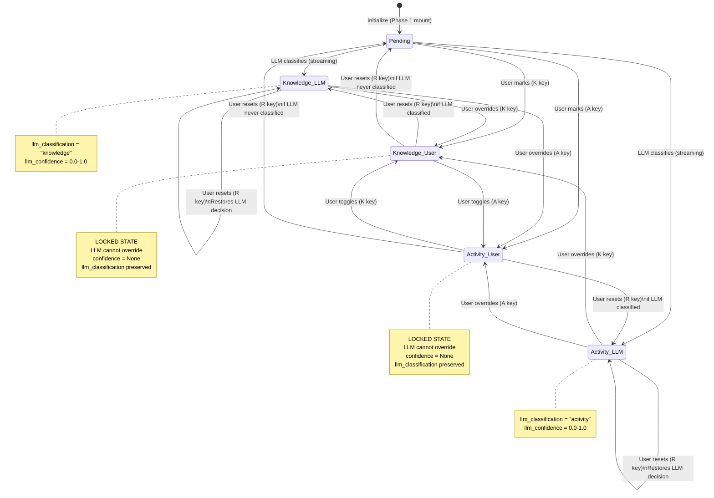
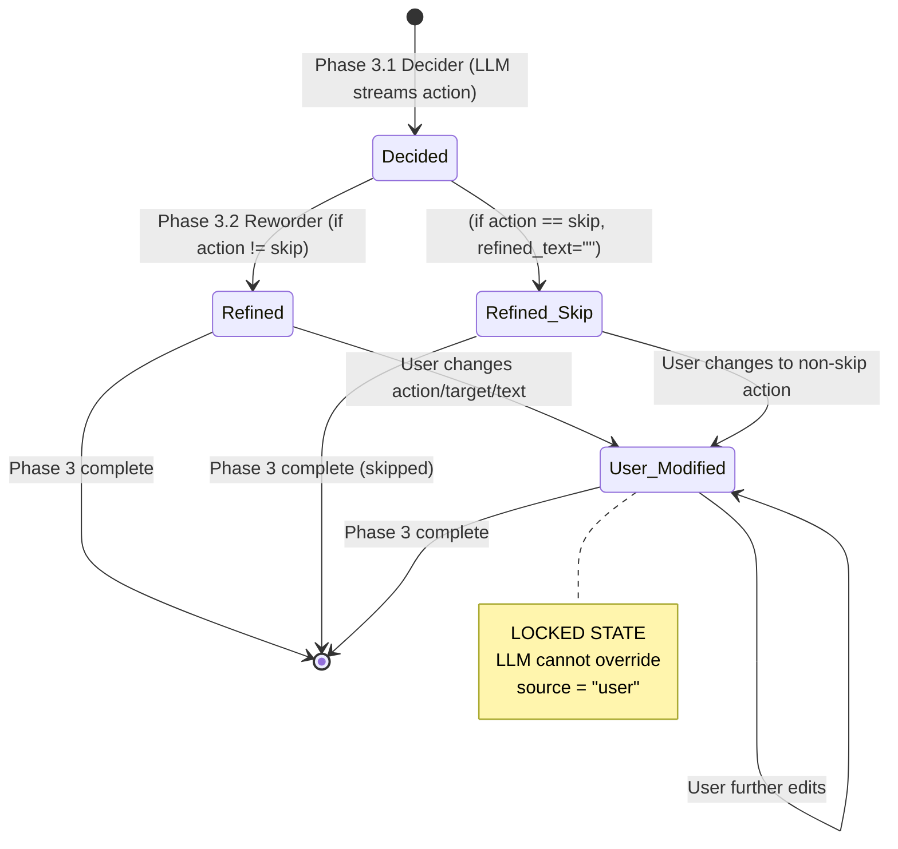
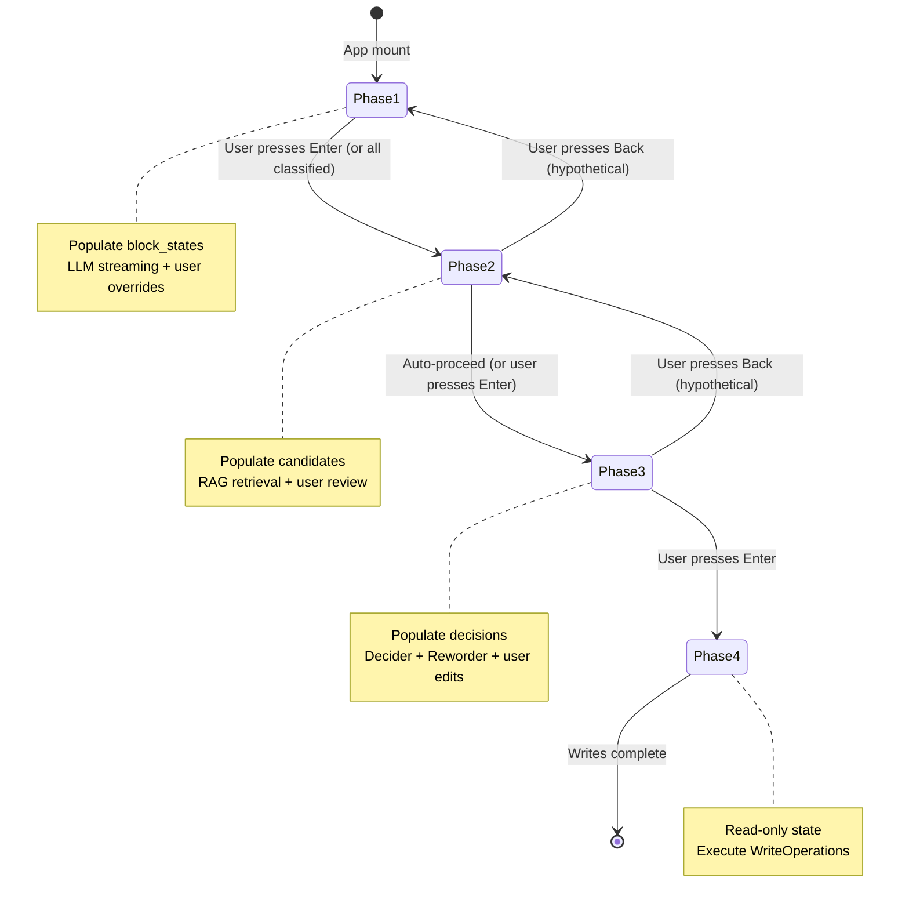

# TUI Data Model Specification

**Feature**: Interactive TUI for Knowledge Extraction
**Created**: 2025-10-29
**Status**: Design
**Related**: [spec.md](./spec.md) | [plan.md](./plan.md) | [interactive-tui-design.md](./interactive-tui-design.md)

---

## Table of Contents

- [Overview](#overview)
- [Core Entities](#core-entities)
  - [BlockState](#blockstate)
  - [IntegrationDecision](#integrationdecision)
  - [CandidatePage](#candidatepage)
  - [ScreenState](#screenstate)
- [Data Flow](#data-flow)
- [State Management Patterns](#state-management-patterns)
- [Validation Rules](#validation-rules)
- [State Transitions](#state-transitions)
- [Performance Considerations](#performance-considerations)

---

## Overview

The Interactive TUI state model manages user decisions and LLM outputs across four phases of knowledge extraction. This document defines the canonical data structures that serve as the shared state between UI screens, LLM client, and write execution.

**Design Principles**:

1. **User decisions override LLM decisions** - Once a user marks state, it's locked
2. **Immutable source tracking** - Every classification/decision records its origin (user vs LLM)
3. **Progressive enrichment** - State accumulates through phases (Phase 1 → Phase 2 → Phase 3 → Phase 4)
4. **Minimal coupling** - Each entity can be serialized/deserialized independently

---

## Core Entities

### BlockState

**Purpose**: Tracks the classification state of each journal block through Phase 1 extraction.

#### Field Definitions

```python
@dataclass
class BlockState:
    """
    Classification state for a single journal block.

    Lifecycle:
    - Created on Phase1Screen mount (all blocks initialized as "pending")
    - Updated during LLM streaming (classification + confidence)
    - Updated by user overrides (classification changed, source="user")
    - Read in Phase 2/3 to filter knowledge blocks
    """
    block_id: str
    """
    Hybrid ID from journal block (id:: property or content hash).
    Must match LogseqBlock.id from parsed journal entry.
    """

    classification: Literal["pending", "knowledge", "activity"]
    """
    Current classification state:
    - "pending": Waiting for LLM analysis or user decision
    - "knowledge": Lasting insight worth integrating
    - "activity": Daily log entry (skip integration)
    """

    confidence: float | None
    """
    LLM confidence score (0.0-1.0) or None if user-marked.

    Guidelines:
    - 0.90-1.00: High confidence (normal display)
    - 0.75-0.89: Good confidence (normal display)
    - 0.60-0.74: Warning range (yellow color, suggest review)
    - 0.00-0.59: Low confidence (⚠ indicator, definitely review)
    - None: User-marked classification (no LLM confidence)
    """

    source: Literal["user", "llm"]
    """
    Origin of classification decision:
    - "user": User manually marked (FR-009: cannot be overridden by LLM)
    - "llm": LLM classified (can be overridden by user)
    """

    llm_classification: Literal["knowledge", "activity"] | None
    """
    Original LLM classification (preserved when user overrides).

    - None: LLM hasn't classified this block yet
    - "knowledge"/"activity": LLM's original decision before user override

    Used for smart reset behavior (R key):
    - If llm_classification is not None: Reset to LLM's original decision
    - If llm_classification is None: Reset to "pending" (LLM hasn't decided yet)

    This field is populated when:
    1. LLM streams a classification → set to LLM's decision
    2. User overrides → preserved (not changed)
    3. User resets → used to restore LLM decision or set to None if resetting to pending
    """

    llm_confidence: float | None
    """
    Original LLM confidence score (preserved when user overrides).

    - None: LLM hasn't classified this block yet, or had no confidence
    - 0.0-1.0: LLM's original confidence before user override

    Used to restore confidence when user resets to LLM decision.
    Always paired with llm_classification (both None or both set).
    """
```

#### State Transitions

```
INITIAL STATE:
  classification: "pending"
  confidence: None
  source: "llm"
  llm_classification: None
  llm_confidence: None

TRANSITIONS:

1. LLM Classification (streaming)
   pending → knowledge/activity
   - confidence: 0.0-1.0 (from LLM response)
   - source: "llm"
   - llm_classification: Same as classification (preserve original)
   - llm_confidence: Same as confidence (preserve original)

2. User Override (keyboard action: K/A)
   pending/knowledge/activity → knowledge/activity
   - confidence: None (user decisions don't have confidence scores)
   - source: "user"
   - llm_classification: PRESERVED (not changed)
   - llm_confidence: PRESERVED (not changed)

3. User Reset (keyboard action: R)
   Two cases:

   a) Reset after LLM has classified (llm_classification != None):
      knowledge/activity (source="user") → knowledge/activity (source="llm")
      - classification: Restored from llm_classification
      - confidence: Restored from llm_confidence
      - source: "llm"
      - llm_classification: PRESERVED
      - llm_confidence: PRESERVED

   b) Reset before LLM has classified (llm_classification == None):
      knowledge/activity (source="user") → pending
      - classification: "pending"
      - confidence: None
      - source: "llm"
      - llm_classification: None
      - llm_confidence: None

LOCKED STATE:
  When source="user", the LLM MUST NOT modify this BlockState.
  User decisions are final until explicitly reset.
```

#### Validation Rules

```python
def validate_block_state(state: BlockState) -> None:
    """Validation rules for BlockState integrity."""

    # Rule 1: block_id must be non-empty string
    assert state.block_id.strip(), "block_id cannot be empty"

    # Rule 2: confidence must be in valid range or None
    if state.confidence is not None:
        assert 0.0 <= state.confidence <= 1.0, \
            f"confidence must be 0.0-1.0, got {state.confidence}"

    # Rule 3: user-marked blocks MUST have confidence=None
    if state.source == "user":
        assert state.confidence is None, \
            "user-marked blocks must have confidence=None"

    # Rule 4: LLM-classified non-pending blocks SHOULD have confidence
    if state.source == "llm" and state.classification != "pending":
        # Warning only (not assertion) - allows recovery from malformed LLM responses
        if state.confidence is None:
            logger.warning(f"LLM-classified block {state.block_id} missing confidence")

    # Rule 5: llm_classification and llm_confidence must be paired
    if state.llm_classification is not None:
        # llm_confidence can be None (malformed LLM response), but should warn
        if state.llm_confidence is None:
            logger.warning(f"Block {state.block_id} has llm_classification but no llm_confidence")

    # Rule 6: llm_confidence must be in valid range if not None
    if state.llm_confidence is not None:
        assert 0.0 <= state.llm_confidence <= 1.0, \
            f"llm_confidence must be 0.0-1.0, got {state.llm_confidence}"
```

#### Example Instances

```python
# Example 1: User manually marked as knowledge (after LLM classified it as activity)
BlockState(
    block_id="abc123-def456",
    classification="knowledge",
    confidence=None,
    source="user",
    llm_classification="activity",  # LLM originally said activity
    llm_confidence=0.88  # LLM's original confidence
)
# If user presses R: will reset to classification="activity", confidence=0.88, source="llm"

# Example 2: LLM classified as activity with high confidence
BlockState(
    block_id="hash:md5:1a2b3c4d5e6f",
    classification="activity",
    confidence=0.94,
    source="llm",
    llm_classification="activity",  # Same as current classification
    llm_confidence=0.94  # Same as current confidence
)

# Example 3: Pending LLM analysis (initial state)
BlockState(
    block_id="78gh-ijkl-9012",
    classification="pending",
    confidence=None,
    source="llm",
    llm_classification=None,  # LLM hasn't classified yet
    llm_confidence=None
)

# Example 4: User marked before LLM could classify
BlockState(
    block_id="user-early-uuid",
    classification="knowledge",
    confidence=None,
    source="user",
    llm_classification=None,  # User marked before LLM streamed this block
    llm_confidence=None
)
# If user presses R: will reset to classification="pending" (LLM never classified)

# Example 5: LLM classified as knowledge with low confidence (needs review)
BlockState(
    block_id="mnop-qrst-uvwx",
    classification="knowledge",
    confidence=0.58,  # ⚠ Low confidence - UI shows warning
    source="llm",
    llm_classification="knowledge",
    llm_confidence=0.58
)
```

#### Relationships

- **1:1 with LogseqBlock**: Each BlockState corresponds to exactly one block from the parsed journal entry
- **Referenced by IntegrationDecision**: Integration decisions reference BlockState.block_id as knowledge_block_id
- **Grouped in ScreenState**: All BlockStates stored in ScreenState.block_states dict

---

### IntegrationDecision

**Purpose**: Tracks the decision about integrating a specific knowledge block into a target page (Phase 3).

#### Field Definitions

```python
@dataclass
class IntegrationDecision:
    """
    Decision about where and how to integrate a knowledge block.

    Lifecycle:
    - Created in Phase 3.1 (Decider) with action + confidence
    - Updated in Phase 3.2 (Reworder) with refined_text
    - Updated by user overrides (action/target changed, source="user")
    - Executed in Phase 4 (converted to WriteOperation)
    """
    knowledge_block_id: str
    """
    Hybrid ID of the source knowledge block from journal entry.
    Must reference a BlockState with classification="knowledge".
    """

    target_page: str
    """
    Destination page name (without extension).
    Example: "Software Architecture" (not "pages/Software Architecture.md")
    """

    action: Literal["skip", "add_section", "add_under", "replace"]
    """
    User-friendly action type (FR-022: friendly terminology):
    - "skip": Don't integrate (duplicate, irrelevant, too vague)
    - "add_section": APPEND_ROOT - Add as top-level block
    - "add_under": APPEND_CHILD - Add as child of target_block_id
    - "replace": UPDATE - Replace content of target_block_id

    Technical mapping:
      skip → IGNORE_* (various ignore reasons)
      add_section → APPEND_ROOT
      add_under → APPEND_CHILD
      replace → UPDATE
    """

    target_block_id: str | None
    """
    Hybrid ID of target block for "add_under" or "replace" actions.

    - Required for: "add_under", "replace"
    - Must be None for: "skip", "add_section"
    - References a block within target_page (resolved via RAG chunk data)
    """

    target_block_title: str | None
    """
    Human-readable title/preview of target block for UI display.

    Example: "Bounded Context Pattern" (first line of target block)
    Used in UI: "Add under 'Bounded Context Pattern'" vs "Add under 'abc123...'"

    - Required for: "add_under", "replace"
    - Should be None for: "skip", "add_section"
    """

    confidence: float
    """
    LLM decision confidence (0.0-1.0).

    Even user-marked decisions store the original LLM confidence
    for reference. This allows users to see "I overrode an 85% confidence
    decision" in future UX improvements.
    """

    refined_text: str
    """
    Reworded content for evergreen knowledge base (Phase 3.2 output).

    - For action="skip": Empty string (no content to refine)
    - For other actions: LLM-reworded text, optionally user-edited

    Transformation:
      Journal: "Had great discussion with Sarah about microservices today"
      Refined: "Bounded contexts should drive microservice boundaries
                rather than technical layer separation."
    """

    source: Literal["user", "llm"]
    """
    Origin of decision:
    - "user": User modified action/target/text (locked against LLM override)
    - "llm": LLM-generated decision (can be overridden by user)
    """

    skip_reason: str | None = None
    """
    Optional explanation for skip actions (UI display only).

    Examples:
    - "Already covered in this page"
    - "Not relevant to page topic"
    - "Too vague to integrate"

    Not used for Phase 4 execution, purely informational.
    """
```

#### State Transitions

```
INITIAL STATE (Phase 3.1 - Decider):
  action: "skip" / "add_section" / "add_under" / "replace"
  confidence: 0.0-1.0 (from Decider LLM)
  refined_text: "" (not yet generated)
  source: "llm"

TRANSITIONS:

1. Rewording (Phase 3.2 - automatic for non-skip)
   refined_text: "" → "Reworded content..."
   - Only applies if action != "skip"
   - Streams progressively during LLM generation

2. User Changes Action (keyboard: Space)
   action: skip ↔ add_section ↔ add_under ↔ replace
   - source: "user"
   - If changing FROM skip TO integration: refined_text remains empty
     (user can press 'E' to manually write content)
   - If changing TO skip: refined_text preserved but ignored

3. User Changes Target (keyboard: T)
   target_block_id: "abc123" → "def456"
   target_block_title: "Old Block" → "New Block"
   - source: "user"
   - Only applicable for "add_under" / "replace" actions

4. User Edits Text (keyboard: E)
   refined_text: "LLM version..." → "User-edited version..."
   - source: "user"
   - Preserves original refined_text as baseline

LOCKED STATE:
  When source="user", LLM MUST NOT modify this IntegrationDecision.
```

#### Validation Rules

```python
def validate_integration_decision(decision: IntegrationDecision) -> None:
    """Validation rules for IntegrationDecision integrity."""

    # Rule 1: knowledge_block_id must be non-empty
    assert decision.knowledge_block_id.strip(), \
        "knowledge_block_id cannot be empty"

    # Rule 2: target_page must be non-empty
    assert decision.target_page.strip(), \
        "target_page cannot be empty"

    # Rule 3: confidence must be in valid range
    assert 0.0 <= decision.confidence <= 1.0, \
        f"confidence must be 0.0-1.0, got {decision.confidence}"

    # Rule 4: "add_under" and "replace" require target_block_id
    if decision.action in ("add_under", "replace"):
        assert decision.target_block_id is not None, \
            f"{decision.action} requires target_block_id"
        assert decision.target_block_title is not None, \
            f"{decision.action} should have target_block_title for UX"

    # Rule 5: "skip" and "add_section" must NOT have target_block_id
    if decision.action in ("skip", "add_section"):
        assert decision.target_block_id is None, \
            f"{decision.action} must have target_block_id=None"

    # Rule 6: Non-skip actions should have refined_text
    # (Warning only - user might change action before editing text)
    if decision.action != "skip" and not decision.refined_text.strip():
        logger.warning(
            f"Decision for {decision.knowledge_block_id} → {decision.target_page} "
            f"has action '{decision.action}' but no refined_text"
        )
```

#### Example Instances

```python
# Example 1: LLM decision to add as new section
IntegrationDecision(
    knowledge_block_id="abc123-def456",
    target_page="Software Architecture",
    action="add_section",
    target_block_id=None,
    target_block_title=None,
    confidence=0.88,
    refined_text="Bounded contexts should drive microservice boundaries "
                 "rather than technical layer separation.",
    source="llm",
    skip_reason=None
)

# Example 2: User-modified decision to add under specific block
IntegrationDecision(
    knowledge_block_id="abc123-def456",
    target_page="Microservices",
    action="add_under",
    target_block_id="target-uuid-5678",
    target_block_title="Bounded Context Pattern",
    confidence=0.92,  # Original LLM confidence preserved
    refined_text="User-edited version of the refined text...",
    source="user",  # User changed from "add_section" to "add_under"
    skip_reason=None
)

# Example 3: LLM decision to skip (duplicate)
IntegrationDecision(
    knowledge_block_id="xyz789-ghi012",
    target_page="Domain-Driven Design",
    action="skip",
    target_block_id=None,
    target_block_title=None,
    confidence=0.95,
    refined_text="",  # No refinement needed for skips
    source="llm",
    skip_reason="Already covered in this page"
)

# Example 4: Replace existing block
IntegrationDecision(
    knowledge_block_id="mnop-qrst-uvwx",
    target_page="Databases",
    action="replace",
    target_block_id="old-block-uuid-1234",
    target_block_title="Vector Databases Overview",
    confidence=0.76,
    refined_text="ChromaDB uses HNSW for approximate nearest neighbor search, "
                 "trading recall for query speed via ef_construction parameter.",
    source="llm",
    skip_reason=None
)
```

#### Relationships

- **Many:1 with BlockState**: Many IntegrationDecisions can reference the same knowledge_block_id (one block can integrate into multiple pages)
- **Many:1 with CandidatePage**: Many IntegrationDecisions can target the same page
- **1:1 with WriteOperation (Phase 4)**: Each non-skip IntegrationDecision becomes one WriteOperation
- **Grouped in ScreenState**: All IntegrationDecisions stored in ScreenState.decisions dict with key (knowledge_block_id, target_page)

---

### CandidatePage

**Purpose**: Represents a page retrieved during Phase 2 RAG search with user inclusion/exclusion state.

#### Field Definitions

```python
@dataclass
class CandidatePage:
    """
    RAG search result for a single knowledge block.

    Lifecycle:
    - Created in Phase 2 (RAG search: semantic + hinted)
    - Updated by user in review mode (included toggled)
    - Read in Phase 3.1 to determine which pages to evaluate
    """
    page_name: str
    """
    Page name without extension.
    Example: "Software Architecture" (not "pages/Software Architecture.md")
    """

    similarity_score: float
    """
    Semantic match score from RAG vector search (0.0-1.0).

    Higher scores = more semantically similar to knowledge block content.
    Used for:
    - Sorting candidates (highest match first)
    - UI display (89% match)
    - User decision-making (exclude low-match pages)

    Note: Hinted pages (from [[Page Links]]) may have similarity_score=1.0
          to prioritize them over purely semantic matches.
    """

    included: bool
    """
    User selection state for Phase 3 evaluation.

    - True: Include in Phase 3 Decider/Reworder (default)
    - False: Exclude from Phase 3 (user deselected in review mode)

    Default: True (all candidates initially included)
    """

    blocks: list[dict]
    """
    Blocks within the page available for targeting.

    Each block dict contains:
    {
        "id": str,           # Hybrid ID (id:: property or content hash)
        "content": str,      # First line of block (for UI display)
        "depth": int,        # Nesting level (0=root, 1=child, etc.)
        "parent_id": str | None  # Parent block ID (None for root blocks)
    }

    Used for:
    - Phase 3 UI: "Pick location" dialog shows these blocks
    - Phase 3 Decider: LLM selects target_block_id from this list
    - Phase 4 Execution: find_block_by_id() looks up these IDs

    Empty list is valid (page has no blocks yet, only APPEND_ROOT allowed).
    """

    search_method: Literal["semantic", "hinted"] = "semantic"
    """
    How this page was discovered (informational only).

    - "semantic": From vector similarity search
    - "hinted": From [[Page Name]] link in journal entry

    Hinted pages are typically prioritized higher (similarity_score=1.0).
    """
```

#### Validation Rules

```python
def validate_candidate_page(candidate: CandidatePage) -> None:
    """Validation rules for CandidatePage integrity."""

    # Rule 1: page_name must be non-empty
    assert candidate.page_name.strip(), "page_name cannot be empty"

    # Rule 2: similarity_score must be in valid range
    assert 0.0 <= candidate.similarity_score <= 1.0, \
        f"similarity_score must be 0.0-1.0, got {candidate.similarity_score}"

    # Rule 3: blocks list structure validation
    for block in candidate.blocks:
        assert "id" in block and block["id"].strip(), \
            "Each block must have non-empty 'id'"
        assert "content" in block, \
            "Each block must have 'content' (can be empty string)"
        assert "depth" in block and block["depth"] >= 0, \
            "Each block must have depth >= 0"
        # parent_id can be None (root blocks)
```

#### Example Instances

```python
# Example 1: High-match semantic search result with blocks
CandidatePage(
    page_name="Software Architecture",
    similarity_score=0.89,
    included=True,
    blocks=[
        {
            "id": "root-block-uuid-1",
            "content": "Microservices Overview",
            "depth": 0,
            "parent_id": None
        },
        {
            "id": "child-block-uuid-2",
            "content": "Service Decomposition Strategies",
            "depth": 1,
            "parent_id": "root-block-uuid-1"
        },
        {
            "id": "child-block-uuid-3",
            "content": "Inter-Service Communication",
            "depth": 1,
            "parent_id": "root-block-uuid-1"
        }
    ],
    search_method="semantic"
)

# Example 2: Hinted page (from [[Page Link]])
CandidatePage(
    page_name="Domain-Driven Design",
    similarity_score=1.0,  # Prioritized due to explicit link
    included=True,
    blocks=[
        {
            "id": "ddd-root-uuid",
            "content": "Bounded Context Pattern",
            "depth": 0,
            "parent_id": None
        }
    ],
    search_method="hinted"
)

# Example 3: Low-match page excluded by user
CandidatePage(
    page_name="Daily Standup Notes",
    similarity_score=0.45,
    included=False,  # User deselected in Phase 2 review
    blocks=[],
    search_method="semantic"
)

# Example 4: Empty page (no blocks yet)
CandidatePage(
    page_name="New Topic Page",
    similarity_score=0.72,
    included=True,
    blocks=[],  # Page exists but has no blocks (only APPEND_ROOT possible)
    search_method="semantic"
)
```

#### Relationships

- **Many:1 with BlockState**: Many CandidatePages can be retrieved for one knowledge block
- **1:Many with IntegrationDecision**: One CandidatePage can have many IntegrationDecisions targeting it
- **Grouped in ScreenState**: CandidatePages stored in ScreenState.candidates dict with key knowledge_block_id

---

### ScreenState

**Purpose**: Central application state shared across all TUI screens (Phase 1-4).

#### Field Definitions

```python
@dataclass
class ScreenState:
    """
    Shared state container for the entire extraction session.

    Lifecycle:
    - Created on ExtractionApp mount
    - Passed to each Screen via constructor
    - Mutated by screens as user progresses through phases
    - Consumed by Phase 4 for write execution
    """
    current_phase: int
    """
    Active phase number (1-4).

    Used for:
    - Navigation tracking (which screen to display)
    - Progress indicators (Phase 2/4)
    - Validation (can't skip to Phase 3 without completing Phase 1)
    """

    journal_entry: JournalEntry
    """
    Loaded journal data (parsed LogseqOutline).

    Contains:
    - date: Journal date (YYYY-MM-DD)
    - root_blocks: list[LogseqBlock] (hierarchical structure)

    Immutable after loading - used as source of truth for block IDs,
    content, and hierarchy throughout all phases.
    """

    block_states: dict[str, BlockState]
    """
    Map of block_id → BlockState for all blocks in journal entry.

    Populated in Phase 1 on mount (all initialized as "pending").
    Updated during:
    - Phase 1: LLM streaming + user overrides
    - Phase 2-4: Read-only (filter for classification="knowledge")

    Key invariant: len(block_states) == total_block_count(journal_entry)
    """

    candidates: dict[str, list[CandidatePage]]
    """
    Map of knowledge_block_id → list[CandidatePage] from RAG search.

    Populated in Phase 2 (RAG search: semantic + hinted).
    Updated during:
    - Phase 2: RAG retrieval + user review (toggling included)
    - Phase 3-4: Read-only (filter for included=True)

    Only contains entries for blocks with classification="knowledge".
    """

    decisions: dict[tuple[str, str], IntegrationDecision]
    """
    Map of (knowledge_block_id, target_page) → IntegrationDecision.

    Populated in Phase 3 (Decider + Reworder + user overrides).
    Updated during:
    - Phase 3.1: Decider creates initial decisions
    - Phase 3.2: Reworder adds refined_text
    - Phase 3: User overrides (action/target/text changes)
    - Phase 4: Read-only (convert to WriteOperations)

    Key structure allows O(1) lookup for any (block, page) pair.
    Multiple decisions can share same knowledge_block_id (multi-page integration).
    """

    config: Config
    """
    User configuration (from ~/.config/logsqueak/config.yaml).

    Used for:
    - LLM client initialization (endpoint, API key, models)
    - Graph path resolution
    - RAG parameters (top_k)

    Immutable after app initialization.
    """

    llm_client: LLMClient
    """
    Shared LLM client instance for all phases.

    Provides streaming methods:
    - stream_extract_ndjson() - Phase 1
    - stream_decisions_ndjson() - Phase 3.1 + 3.2

    Initialized once on app mount, reused across screens.
    """
```

#### Validation Rules

```python
def validate_screen_state(state: ScreenState) -> None:
    """Validation rules for ScreenState integrity."""

    # Rule 1: current_phase must be 1-4
    assert 1 <= state.current_phase <= 4, \
        f"current_phase must be 1-4, got {state.current_phase}"

    # Rule 2: block_states must cover all journal blocks
    total_blocks = count_all_blocks(state.journal_entry.root_blocks)
    assert len(state.block_states) == total_blocks, \
        f"block_states has {len(state.block_states)} entries, " \
        f"but journal has {total_blocks} blocks"

    # Rule 3: candidates must only reference knowledge blocks
    for block_id in state.candidates.keys():
        if block_id in state.block_states:
            assert state.block_states[block_id].classification == "knowledge", \
                f"candidates[{block_id}] exists but block is not classified as knowledge"

    # Rule 4: decisions must only reference knowledge blocks and candidate pages
    for (block_id, page_name), decision in state.decisions.items():
        # Block must be knowledge
        if block_id in state.block_states:
            assert state.block_states[block_id].classification == "knowledge", \
                f"decision for {block_id} exists but block is not knowledge"

        # Page must be in candidates (or was in candidates before user excluded)
        # Note: We don't enforce included=True here because user might have
        # excluded page AFTER decision was made (edge case handling)

    # Rule 5: Phase progression validation
    if state.current_phase >= 2:
        # Phase 2+ requires at least one knowledge block
        knowledge_count = sum(
            1 for bs in state.block_states.values()
            if bs.classification == "knowledge"
        )
        assert knowledge_count > 0, \
            "Cannot proceed to Phase 2+ without any knowledge blocks"

    if state.current_phase >= 3:
        # Phase 3+ requires candidate pages
        assert len(state.candidates) > 0, \
            "Cannot proceed to Phase 3 without candidate pages"
```

#### Example Instance

```python
# Example: State after completing Phase 3
ScreenState(
    current_phase=4,

    journal_entry=JournalEntry(
        date="2025-10-29",
        root_blocks=[
            # ... parsed LogseqBlock objects
        ]
    ),

    block_states={
        "block-1-uuid": BlockState(
            block_id="block-1-uuid",
            classification="knowledge",
            confidence=0.92,
            source="llm"
        ),
        "block-2-uuid": BlockState(
            block_id="block-2-uuid",
            classification="activity",
            confidence=None,
            source="user"  # User marked
        ),
        "block-3-uuid": BlockState(
            block_id="block-3-uuid",
            classification="knowledge",
            confidence=None,
            source="user"  # User marked
        ),
        # ... more BlockStates for all journal blocks
    },

    candidates={
        "block-1-uuid": [
            CandidatePage(
                page_name="Software Architecture",
                similarity_score=0.89,
                included=True,
                blocks=[...],
                search_method="semantic"
            ),
            CandidatePage(
                page_name="Microservices",
                similarity_score=0.85,
                included=True,
                blocks=[...],
                search_method="hinted"
            ),
        ],
        "block-3-uuid": [
            CandidatePage(
                page_name="Databases",
                similarity_score=0.76,
                included=True,
                blocks=[...],
                search_method="semantic"
            ),
        ],
    },

    decisions={
        ("block-1-uuid", "Software Architecture"): IntegrationDecision(
            knowledge_block_id="block-1-uuid",
            target_page="Software Architecture",
            action="add_section",
            target_block_id=None,
            target_block_title=None,
            confidence=0.88,
            refined_text="Bounded contexts should drive...",
            source="llm",
            skip_reason=None
        ),
        ("block-1-uuid", "Microservices"): IntegrationDecision(
            knowledge_block_id="block-1-uuid",
            target_page="Microservices",
            action="add_under",
            target_block_id="target-uuid-5678",
            target_block_title="Bounded Context Pattern",
            confidence=0.92,
            refined_text="Bounded contexts are more significant...",
            source="user",  # User changed target location
            skip_reason=None
        ),
        ("block-3-uuid", "Databases"): IntegrationDecision(
            knowledge_block_id="block-3-uuid",
            target_page="Databases",
            action="replace",
            target_block_id="old-block-uuid",
            target_block_title="Vector Databases Overview",
            confidence=0.76,
            refined_text="ChromaDB uses HNSW for...",
            source="llm",
            skip_reason=None
        ),
    },

    config=Config(...),  # Loaded from config.yaml
    llm_client=OpenAICompatLLMClient(...)  # Initialized with config
)
```

#### Relationships

- **1:1 with ExtractionApp**: One ScreenState per TUI session
- **1:Many with Screen**: Passed to all 4 Screen instances (shared mutable reference)
- **Contains all other entities**: Acts as root container for BlockState, CandidatePage, IntegrationDecision collections

---

## Data Flow

### Phase-by-Phase Data Evolution

```
PHASE 1: Knowledge Extraction
├─ INPUT:  journal_entry (JournalEntry)
├─ OUTPUT: block_states (dict[str, BlockState])
└─ FLOW:
   1. Initialize block_states with all blocks as "pending"
   2. Stream LLM classifications → update block_states
   3. User overrides → update block_states (source="user")
   4. Proceed → filter knowledge blocks for Phase 2

PHASE 2: Candidate Page Retrieval
├─ INPUT:  block_states (knowledge blocks only)
├─ OUTPUT: candidates (dict[str, list[CandidatePage]])
└─ FLOW:
   1. For each knowledge block: RAG search (semantic + hinted)
   2. Store results in candidates dict
   3. [Optional] User review → toggle CandidatePage.included
   4. Proceed → filter included candidates for Phase 3

PHASE 3: Integration Decisions
├─ INPUT:  block_states (knowledge), candidates (included only)
├─ OUTPUT: decisions (dict[tuple[str, str], IntegrationDecision])
└─ FLOW:
   1. For each (knowledge_block, candidate_page) pair:
      a. Phase 3.1 (Decider): Create IntegrationDecision with action
      b. Phase 3.2 (Reworder): Add refined_text to decision
   2. User overrides → update decisions (source="user")
   3. Proceed → convert non-skip decisions to Phase 4 input

PHASE 4: Write Operations
├─ INPUT:  decisions (action != "skip")
├─ OUTPUT: Updated Logseq graph + journal provenance markers
└─ FLOW:
   1. Group decisions by target_page
   2. For each page:
      a. Convert IntegrationDecisions → WriteOperations
      b. Parse page AST
      c. Apply operations (UPDATE/APPEND_CHILD/APPEND_ROOT)
      d. Generate UUIDs for new blocks
      e. Serialize and write page
      f. Atomically add processed:: marker to journal
   3. Display completion summary
```

### Cross-Phase Data Dependencies

```
journal_entry (immutable)
    ↓
    └─> Phase 1 → block_states
                     ↓
                     └─> Phase 2 → candidates
                                      ↓
                                      └─> Phase 3 → decisions
                                                       ↓
                                                       └─> Phase 4 → WriteOperations
```

**Key Insight**: Each phase enriches the state without modifying previous phase outputs. This enables:

- **Idempotent re-runs**: Could re-run Phase 3 with same candidates without re-running Phase 2
- **Debugging**: Can inspect state at any phase boundary
- **Testing**: Can mock earlier phase outputs to test later phases in isolation

---

## State Management Patterns

### Immutability vs Mutation Decisions

**Immutable Entities** (never modified after creation):

- `JournalEntry` - Source of truth for journal structure
- `Config` - User configuration loaded once
- `LLMClient` - Shared client instance

**Mutable Entities** (updated during session):

- `BlockState` - Updated during Phase 1 (LLM streaming + user input)
- `CandidatePage.included` - Updated during Phase 2 (user toggles)
- `IntegrationDecision` - Updated during Phase 3 (LLM streaming + user edits)
- `ScreenState.current_phase` - Updated on phase transitions

**Rationale**: Immutability for inputs prevents accidental corruption. Mutability for UI state enables reactive updates without full rebuilds.

### Shared State Access Pattern

All screens access the same `ScreenState` instance:

```python
class ExtractionApp(App):
    def __init__(self, journal_entry: JournalEntry, config: Config):
        super().__init__()

        # Create shared state once
        self.screen_state = ScreenState(
            current_phase=1,
            journal_entry=journal_entry,
            block_states={},
            candidates={},
            decisions={},
            config=config,
            llm_client=get_llm_client(config)
        )

    def on_mount(self) -> None:
        # Pass same state instance to Phase 1
        self.push_screen(Phase1Screen(self.screen_state))

class Phase1Screen(Screen):
    def __init__(self, state: ScreenState):
        super().__init__()
        self.state = state  # Shared reference

    async def on_mount(self) -> None:
        # Initialize block_states (mutates shared state)
        for block in self._all_blocks():
            self.state.block_states[block.id] = BlockState(
                block_id=block.id,
                classification="pending",
                confidence=None,
                source="llm"
            )

    def action_continue(self) -> None:
        # Pass same state to Phase 2
        self.app.push_screen(Phase2Screen(self.state))
```

**Advantages**:

- No serialization overhead between phases
- Easy to implement "back" navigation (just pop screen)
- Simple debugging (single object to inspect)

**Trade-offs**:

- Risk of unintended mutations (mitigated by validation rules)
- No automatic undo/redo (would need separate history tracking)

### Reactive UI Updates

Textual's reactive system enables automatic UI updates when state changes:

```python
class Phase1Screen(Screen):
    def __init__(self, state: ScreenState):
        super().__init__()
        self.state = state

    async def _stream_extraction(self) -> None:
        """Stream LLM classifications"""
        async for block_id, is_knowledge, confidence in llm_stream:
            # Mutate shared state
            self.state.block_states[block_id] = BlockState(
                block_id=block_id,
                classification="knowledge" if is_knowledge else "activity",
                confidence=confidence,
                source="llm"
            )

            # Trigger UI update
            self._update_tree_display(block_id)
            self._update_status_bar()

    def _update_tree_display(self, block_id: str) -> None:
        """Update tree node based on current BlockState"""
        tree = self.query_one("#block-tree", Tree)
        node = tree.get_node_by_id(block_id)

        block_state = self.state.block_states[block_id]

        # Update node label with icon + confidence
        if block_state.source == "user":
            icon = "⊙" if block_state.classification == "knowledge" else "⊗"
        elif block_state.classification == "pending":
            icon = "?"
        else:
            icon = "✓" if block_state.classification == "knowledge" else "✗"

        confidence_str = f"{block_state.confidence:.0%}" if block_state.confidence else ""

        node.label = f"{icon} {block.content}  {confidence_str}"
        self.refresh()
```

**Pattern**: State mutation → Manual UI refresh → Screen re-renders affected widgets

---

## Validation Rules

### Global Invariants

**Across All Phases**:

1. Every block in `journal_entry` has exactly one `BlockState` in `block_states`
2. Every `BlockState` references a valid block ID from `journal_entry`
3. All `confidence` values are in range [0.0, 1.0] or None
4. User-marked entities (`source="user"`) have locked state (LLM cannot override)

**Phase-Specific Invariants**:

**Phase 1**:

- All `BlockState` have classification ∈ {"pending", "knowledge", "activity"}
- User-marked `BlockState` have `confidence=None`

**Phase 2**:

- All keys in `candidates` reference `BlockState` with `classification="knowledge"`
- All `CandidatePage.similarity_score` are in range [0.0, 1.0]

**Phase 3**:

- All keys in `decisions` have format `(knowledge_block_id, target_page)`
- All `knowledge_block_id` in `decisions` reference knowledge blocks
- All `IntegrationDecision` with `action="add_under"|"replace"` have non-None `target_block_id`
- All `IntegrationDecision` with `action="skip"|"add_section"` have None `target_block_id`

**Phase 4**:

- At least one `IntegrationDecision` has `action != "skip"` (otherwise, nothing to write)

### Runtime Validation Strategy

```python
# Validation checkpoints
def validate_phase1_complete(state: ScreenState) -> None:
    """Call before proceeding to Phase 2"""
    assert all(
        bs.classification in ("knowledge", "activity")
        for bs in state.block_states.values()
    ), "All blocks must be classified before Phase 2"

def validate_phase2_complete(state: ScreenState) -> None:
    """Call before proceeding to Phase 3"""
    knowledge_count = sum(
        1 for bs in state.block_states.values()
        if bs.classification == "knowledge"
    )
    assert len(state.candidates) >= knowledge_count, \
        "Must have candidates for all knowledge blocks"

def validate_phase3_complete(state: ScreenState) -> None:
    """Call before proceeding to Phase 4"""
    assert len(state.decisions) > 0, \
        "Must have at least one decision before Phase 4"

    non_skip_count = sum(
        1 for d in state.decisions.values()
        if d.action != "skip"
    )
    assert non_skip_count > 0, \
        "Must have at least one non-skip decision to proceed"
```

**When to Validate**:

- After Phase 1 `action_continue()` → `validate_phase1_complete()`
- After Phase 2 auto-proceed → `validate_phase2_complete()`
- After Phase 3 `action_continue()` → `validate_phase3_complete()`
- Before Phase 4 execution → Full `validate_screen_state()`

---

## State Transitions

### BlockState Lifecycle



### IntegrationDecision Lifecycle



### ScreenState Phase Progression



---

## Performance Considerations

### Memory Usage

**Typical Session** (11 root blocks, 22 total blocks, 5 knowledge blocks):

```
journal_entry: ~10 KB (parsed AST)
block_states: 22 × 200 bytes ≈ 4.4 KB
candidates: 5 knowledge × 10 pages × 1 KB ≈ 50 KB
decisions: 5 knowledge × 8 pages × 500 bytes ≈ 20 KB

Total: ~85 KB (negligible)
```

**Large Session** (26 root blocks, 71 total blocks, 15 knowledge blocks):

```
journal_entry: ~30 KB
block_states: 71 × 200 bytes ≈ 14 KB
candidates: 15 knowledge × 10 pages × 1 KB ≈ 150 KB
decisions: 15 knowledge × 8 pages × 500 bytes ≈ 60 KB

Total: ~254 KB (still negligible)
```

**Conclusion**: Memory is not a concern. No need for pagination or lazy loading.

### Lookup Performance

**All data structures use dict/set for O(1) lookups**:

```python
# O(1) block state lookup
block_state = screen_state.block_states[block_id]

# O(1) candidate lookup
candidates = screen_state.candidates[knowledge_block_id]

# O(1) decision lookup
decision = screen_state.decisions[(block_id, page_name)]
```

**No linear scans needed** - UI rendering iterates over dicts, but this is acceptable for ~100 items.

### Streaming Update Efficiency

**Challenge**: Updating UI during LLM streaming without blocking user input.

**Solution**: Async task separation

```python
class Phase1Screen(Screen):
    async def on_mount(self) -> None:
        # Start LLM streaming in background
        self.extraction_task = asyncio.create_task(self._stream_extraction())

    async def _stream_extraction(self) -> None:
        """Runs in background, doesn't block UI event loop"""
        async for block_id, is_knowledge, confidence in llm_stream:
            # Update state
            self.state.block_states[block_id] = BlockState(...)

            # Schedule UI refresh (non-blocking)
            self.call_later(self._update_tree_display, block_id)

    def action_mark_knowledge(self) -> None:
        """User input handler - runs immediately, doesn't wait for streaming"""
        block_id = self._get_selected_block_id()
        self.state.block_states[block_id] = BlockState(
            source="user",  # Locks state
            ...
        )
        self._update_tree_display(block_id)
```

**Performance Target**: <100ms input handling (FR-045, SC-008) achieved by:

1. Async LLM tasks run in background
2. User input handlers are synchronous (no await)
3. UI refreshes scheduled via `call_later()` (non-blocking)

### Serialization (Future Consideration)

**Not currently implemented**, but if we wanted to save/resume sessions:

```python
# JSON serialization
def serialize_state(state: ScreenState) -> str:
    """Convert ScreenState to JSON for persistence"""
    return json.dumps({
        "current_phase": state.current_phase,
        "journal_date": state.journal_entry.date,
        "block_states": {
            block_id: {
                "classification": bs.classification,
                "confidence": bs.confidence,
                "source": bs.source
            }
            for block_id, bs in state.block_states.items()
        },
        "candidates": {
            block_id: [
                {
                    "page_name": cp.page_name,
                    "similarity_score": cp.similarity_score,
                    "included": cp.included
                }
                for cp in candidates
            ]
            for block_id, candidates in state.candidates.items()
        },
        "decisions": {
            f"{block_id}:{page}": {
                "action": d.action,
                "target_block_id": d.target_block_id,
                "confidence": d.confidence,
                "refined_text": d.refined_text,
                "source": d.source
            }
            for (block_id, page), d in state.decisions.items()
        }
    })

# Deserialization
def deserialize_state(json_str: str, config: Config) -> ScreenState:
    """Reconstruct ScreenState from JSON"""
    data = json.loads(json_str)
    # ... rebuild ScreenState with all nested dataclasses
```

**Use cases**: Resume interrupted session, debug state at specific phase, export for testing.

---

## Summary

This data model provides:

1. **Four core entities** (BlockState, IntegrationDecision, CandidatePage, ScreenState) that capture all TUI state
2. **Clear lifecycle documentation** showing when each entity is created, updated, and consumed
3. **Validation rules** ensuring data integrity at phase boundaries
4. **State transition diagrams** showing valid progressions and locked states
5. **Performance analysis** confirming negligible memory usage and O(1) lookups
6. **Shared state pattern** enabling simple cross-screen communication

**Next Steps** (from plan.md Phase 1.2):

- Document NDJSON streaming contract (`contracts/ndjson-streaming.md`)
- Create developer quickstart guide (`quickstart.md`)
- Update agent context with Textual framework knowledge

**Related Documents**:

- [spec.md](./spec.md) - Functional requirements (FR-*) that drive validation rules
- [plan.md](./plan.md) - Implementation phases referencing these entities
- [interactive-tui-design.md](./interactive-tui-design.md) - UI mockups showing these entities in action
